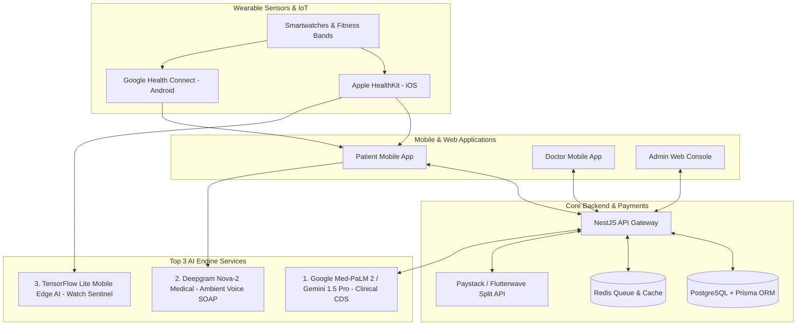
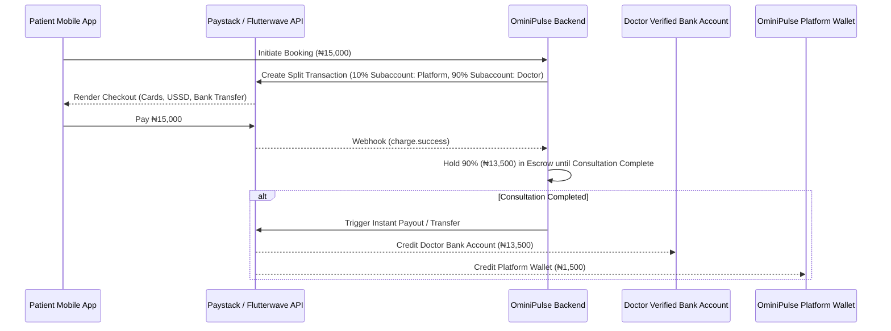
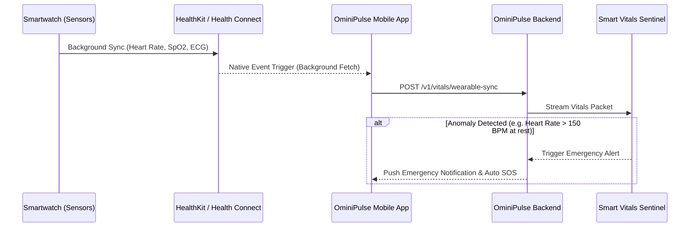

# 🚀 OminiPulse: Next Stages Architecture, Backend Design, Wearable Sync & AI Engine Roadmap

> **Authoritative Technical Handover & Implementation Blueprint**  
> **Target Version**: OminiPulse v2.0  
> **Architectural Scope**: Mobile (React Native/Expo), Web Admin (Next.js/React), Backend API (NestJS/PostgreSQL), Smartwatch Sync (HealthKit/Health Connect), Payment Gateways (Paystack/Flutterwave), True AI Engine (CDS, Voice SOAP, Sentinel Vitals Monitoring).

---

## 🧭 Executive Summary & Handover Context

OminiPulse is an all-in-one e-Health platform built for the African market (starting with Nigeria), providing digital telehealth consultations, e-prescriptions, GPS pharmacy/hospital directories, blood donor matching, and electronic health record (EHR) management.

This document serves as the **master technical blueprint** for the next development phases, providing a step-by-step roadmap for engineers and AI agents continuing work on the codebase.



---

## 🏛️ Stage-by-Stage Implementation Roadmap

```
┌────────────────────────────────────────────────────────────────────────────────────────┐
│                                STAGE IMPLEMENTATION MATRIX                            │
├───────────────┬───────────────────────────────────┬────────────────────────────────────┤
│ Stage         │ Focus Area                        │ Key Deliverables                   │
├───────────────┼───────────────────────────────────┼────────────────────────────────────┤
│ Stage 1       │ Data Wiring & State Management    │ Complete Redux/Zustand & React     │
│               │                                   │ Query integration for real endpoints│
├───────────────┼───────────────────────────────────┼────────────────────────────────────┤
│ Stage 2       │ Production Backend API & Payments │ NestJS API, PostgreSQL DB, Redis,  │
│               │                                   │ Paystack/Flutterwave Split Payments│
├───────────────┼───────────────────────────────────┼────────────────────────────────────┤
│ Stage 3       │ Smartwatch / Wearable Health Sync │ HealthKit & Health Connect bridges,│
│               │                                   │ real-time vitals streaming         │
├───────────────┼───────────────────────────────────┼────────────────────────────────────┤
│ Stage 4       │ Cross-Feature Closed-Loop Audit   │ End-to-end data pipeline across    │
│               │                                   │ Patient, Doctor, and Admin apps    │
├───────────────┼───────────────────────────────────┼────────────────────────────────────┤
│ Stage 5       │ Top 3 Medical AI Engine           │ Clinical CDS, Voice SOAP notes,    │
│               │                                   │ Smart Vitals Anomaly Sentinel      │
└───────────────┴───────────────────────────────────┴────────────────────────────────────┘
```

---

## 💳 Stage 2: Backend Architecture & Payment Gateway Integration

### 1. Technology Stack Selection
- **Framework**: NestJS (TypeScript) or Express with TS for robust modular dependency injection.
- **Database**: PostgreSQL 16+ with Prisma ORM for type-safe schema migrations.
- **Cache & Queue**: Redis + BullMQ for handling push notifications, SMS alerts, and background vitals polling.
- **Real-Time Communication**: Socket.io / WebSockets for consultation messaging and WebRTC signaling (Agora / Twilio / Mediasoup).
- **Payment Gateway Integration**: Paystack & Flutterwave Split Payments API.

### 2. Payment Gateway Architecture & Automated Split Payouts
OminiPulse processes all consultation transactions in Nigerian Naira (`₦`) with automated fee splitting:



- **Supported Payment Channels**: Debit Cards (Verve, Mastercard, Visa), USSD codes (*737#, *919#, etc.), Direct Bank Transfer, Apple Pay, Google Pay.
- **Webhooks Handled**: `charge.success`, `transfer.success`, `transfer.failed`, `refund.processed`.

### 3. Database Schema ERD (Prisma Definition)

```prisma
datasource db {
  provider = "postgresql"
  url      = env("DATABASE_URL")
}

generator client {
  provider = "prisma-client-js"
}

enum Role {
  PATIENT
  DOCTOR
  ADMIN
}

enum AppointmentStatus {
  PENDING
  CONFIRMED
  IN_PROGRESS
  COMPLETED
  CANCELLED
}

enum MalpracticeStatus {
  PENDING
  UNDER_INVESTIGATION
  RESOLVED_GUILTY
  RESOLVED_DISMISSED
}

model User {
  id            String          @id @default(uuid())
  email         String          @unique
  passwordHash  String
  role          Role
  firstName     String
  lastName      String
  phone         String?
  createdAt     DateTime        @default(now())
  updatedAt     DateTime        @updatedAt
  
  patientProfile PatientProfile?
  doctorProfile  DoctorProfile?
  reportsMade    Report[]        @relation("ReporterRelation")
  reportsAgainst Report[]        @relation("AccusedRelation")
}

model PatientProfile {
  id             String          @id @default(uuid())
  userId         String          @unique
  user           User            @relation(fields: [userId], references: [id])
  dateOfBirth    DateTime?
  heightCm       Float?
  weightKg       Float?
  bloodGroup     String?
  genotype       String?
  emergencyPhone String?
  appointments   Appointment[]
  prescriptions  Prescription[]
  vitalsLogs     VitalsLog[]
  wearableLogs   WearableLog[]
}

model DoctorProfile {
  id               String        @id @default(uuid())
  userId           String        @unique
  user             User          @relation(fields: [userId], references: [id])
  licenseNo        String        @unique
  specialty        String
  hospital         String?
  yearsExp         Int           @default(0)
  consultationFeeNgn Float       @default(15000)
  bankName         String?
  accountNumber    String?
  accountName      String?
  isVerified       Boolean       @default(false)
  appointments     Appointment[]
  prescriptions    Prescription[]
}

model Appointment {
  id             String            @id @default(uuid())
  patientId      String
  patient        PatientProfile    @relation(fields: [patientId], references: [id])
  doctorId       String
  doctor         DoctorProfile     @relation(fields: [doctorId], references: [id])
  scheduledAt    DateTime
  status         AppointmentStatus @default(PENDING)
  grossFeeNgn    Float
  platformFeeNgn Float            // 10% Platform fee
  netFeeNgn      Float            // 90% Doctor payout
  paymentRef     String?          // Paystack / Flutterwave Transaction Reference
  notes          String?
  prescription   Prescription?
  createdAt      DateTime          @default(now())
}

model Prescription {
  id            String         @id @default(uuid())
  appointmentId String         @unique
  appointment   Appointment    @relation(fields: [appointmentId], references: [id])
  patientId     String
  patient       PatientProfile @relation(fields: [patientId], references: [id])
  doctorId      String
  doctor        DoctorProfile  @relation(fields: [doctorId], references: [id])
  medications   Json           // Array of { drugName, dosage, frequency, duration }
  qrCodeUrl     String?
  createdAt     DateTime       @default(now())
}

model VitalsLog {
  id            String         @id @default(uuid())
  patientId     String
  patient       PatientProfile @relation(fields: [patientId], references: [id])
  systolicBp    Int?
  diastolicBp   Int?
  heartRate     Int?
  bloodGlucose  Float?
  temperatureC  Float?
  loggedAt      DateTime       @default(now())
}

model WearableLog {
  id            String         @id @default(uuid())
  patientId     String
  patient       PatientProfile @relation(fields: [patientId], references: [id])
  source        String         // "AppleHealthKit" | "GoogleHealthConnect" | "GalaxyWatch"
  heartRateBpm  Int?
  oxygenSatSpO2 Float?
  stepCount     Int?
  sleepHours    Float?
  ecgReading    String?
  syncedAt      DateTime       @default(now())
}

model Report {
  id          String            @id @default(uuid())
  reporterId  String
  reporter    User              @relation("ReporterRelation", fields: [reporterId], references: [id])
  accusedId   String
  accused     User              @relation("AccusedRelation", fields: [accusedId], references: [id])
  reason      String
  evidenceUrl String?
  status      MalpracticeStatus @default(PENDING)
  createdAt   DateTime          @default(now())
}
```

---

## ⌚ Stage 3: Smartwatch & Wearable Device Integration Architecture

To connect Apple Watch (iOS) and Samsung Galaxy Watch / Wear OS (Android) to OminiPulse without forcing users to buy custom hardware, we integrate via native OS Health Bridges.



---

## 🔗 Stage 4: Cross-Feature Closed-Loop Data Flow Audit

The following table maps every feature where data is entered and where it MUST automatically flow across Patient, Doctor, and Admin interfaces:

| Data Source (Input Feature) | Output Feature 1 (Patient) | Output Feature 2 (Doctor) | Output Feature 3 (Admin) |
|---|---|---|---|
| **Doctor Sets Fee (₦15,000)** | Displays on Patient Doctor Profile & Appointment Booking | Doctor Profile & Income Breakdown | Financial Commission Ledger (10% platform fee) |
| **Doctor Sets Bank Account** | Hidden for privacy | Disburses 90% net earnings upon consultation completion | Verified payout ledger |
| **Smartwatch Vitals Sync** | Displays on Patient Health Dashboard & Vitals History | Live Overlay on Video Call Screen during appointment | AI Sentinel Anomaly Feed |
| **Doctor Writes E-Prescription** | Appears in Patient Records & 1-Tap GPS Pharmacy Order | Appears in Patient Consultation History | Compliance Audit Log |
| **Patient Incident Report** | Confirmation & Status Tracker | Notification of Investigation Notice | Admin Incident Resolution Console (Suspend/Ban/MDCN Report) |
| **Patient Ratings & Review** | Displayed on Doctor Profile for all patients | Feedback stats on Doctor Dashboard | Moderation Queue |

---

## 🤖 Stage 5: Top 3 Medical AI Engine Technologies

OminiPulse is built as a **True AI-Powered Healthcare Engine**—not just a basic chatbot wrapper. Below are the **Top 3 Recommended AI Technologies** for OminiPulse:

```
┌────────────────────────────────────────────────────────────────────────────────────────┐
│                        TOP 3 AI TECHNOLOGIES FOR OMINIPULSE                           │
├────────────────────────────────────────────────────────────────────────────────────────┤
│                                                                                        │
│  [1. Google Med-PaLM 2 / Gemini 1.5 Pro (Clinical Domain Fine-Tuned)]                 │
│  • Clinical Decision Support (CDS) for Doctors                                         │
│  • Differential Diagnosis Generation & Drug Interaction Safety Checks                  │
│  • Patient Symptom Checker & EHR Summarization                                         │
│                                                                                        │
│  [2. Deepgram Nova-2 Medical / OpenAI Whisper Medical Speech Engine]                   │
│  • Ambient Voice-to-Text Clinical Transcription                                        │
│  • Real-Time Consultation Video Speech Analysis                                        │
│  • Automated Medical SOAP Note Generation (Subjective, Objective, Plan)                │
│                                                                                        │
│  [3. TensorFlow Lite / PyTorch Mobile Edge AI Engine]                                  │
│  • On-Device Real-Time Smartwatch Sensor Anomaly Detection                             │
│  • Background Tachycardia, AFib & Hypoxia Alert Sentinel                               │
│  • Automated Emergency SOS GPS Dispatch Trigger                                        │
│                                                                                        │
└────────────────────────────────────────────────────────────────────────────────────────┘
```

### 1. Google Med-PaLM 2 / Gemini 1.5 Pro (Clinical Domain Fine-Tuned)
- **Primary Use**: Clinical Decision Support (CDS) for Doctors & Patient Symptom Intelligence.
- **Function**: Prior to a consultation, the AI engine processes the patient’s past medical history, genotype, blood group, current medications, and smartwatch vitals stream.
- **Output for Doctor**: Displays a confidential **AI Clinical Brief** on the doctor’s screen before the video call:
  - *Primary Risk Flags*: e.g. "Patient has elevated resting HR (102 BPM) over last 7 days + history of hypertension."
  - *Drug Interaction Warning*: e.g. "Prescribing Drug X while patient is on Drug Y increases risk of arrhythmia."
  - *Suggested Differential Diagnoses*: 3 evidence-based diagnostic possibilities.

### 2. Deepgram Nova-2 Medical / OpenAI Whisper Medical Speech Model
- **Primary Use**: Ambient Voice Transcription & Automatic SOAP Note Generation.
- **Function**: During video/audio consultations, ambient speech-to-text processes the conversation in real time.
- **Output**: Automatically synthesizes the consultation into standard medical **SOAP format**:
  - **S (Subjective)**: Patient’s chief complaint ("Headache for 3 days, worse in morning").
  - **O (Objective)**: Observed symptoms & smartwatch vitals.
  - **A (Assessment)**: Diagnosis formulated during call.
  - **P (Plan)**: E-prescription medications & recommended lab tests.
- **Doctor Benefit**: Saves doctors 5–10 minutes of manual typing per consultation.

### 3. TensorFlow Lite / PyTorch Mobile Edge AI Engine
- **Primary Use**: Smart Vitals Anomaly Sentinel (Background Watch Monitoring).
- **Function**: Operates as an on-device lightweight background monitoring daemon checking incoming smartwatch data.
- **Alert Triggers**:
  - *Severe Tachycardia*: Resting Heart Rate > 140 BPM for > 5 minutes.
  - *Sudden Hypoxia*: Blood Oxygen (SpO2) drops below 90%.
  - *Arrhythmia/AFib*: Irregular ECG pattern detected by watch sensors.
- **Action**: Instantly sends push notifications to patient, alerts primary doctor, and triggers the **Emergency SOS GPS Hospital Navigator**.

### 4. Admin-Side AI Governance & Verification Engine
- **Automated MDCN License & NIMC ID OCR Verification**:
  - Scans doctor credentials (MDCN certificates, MBBS diplomas, government IDs) using AI Vision OCR + regex parsing.
  - Automatically matches Folio numbers against official regulatory databases and flags suspicious documents for human Admin review.
- **AI Fraud & Prescription Drug Abuse Detector**:
  - Monitors all generated E-Prescriptions across the platform for controlled substance abuse, over-prescribing patterns, or suspicious doctor-patient billing cycles.
  - Instantly alerts Admins and locks high-risk accounts pending investigation.
- **Outbreak & Epidemic Surveillance Radar**:
  - Aggregates anonymized patient symptom logs by LGA (Local Government Area) across Nigeria.
  - Detects early clusters of infectious symptoms (e.g. Lassa Fever, Cholera, Flu) and alerts partner hospital directors and health authorities.

---

## 🔑 Plug-and-Play AI API Key Configuration (Pending Activation)

All AI features for Doctor, Patient, and Admin portals are built with a **Plug-and-Play Architecture**. When you add your API keys into `.env` / environment variables, the system automatically activates the AI features across mobile and web interfaces:

```env
# ─── OMINIPULSE AI ENGINE CONFIGURATION (.env) ─────────────────────────────────
EXPO_PUBLIC_ENABLE_AI_COPILOT=true

# 1. Primary Clinical Intelligence (Google Gemini 1.5 Pro / Med-PaLM 2)
GEMINI_API_KEY=your_google_gemini_api_key_here
GEMINI_CLINICAL_MODEL=gemini-1.5-pro-latest

# 2. Ambient Voice SOAP Note Transcription (Deepgram Nova-2 Medical / Whisper)
DEEPGRAM_API_KEY=your_deepgram_medical_api_key_here
OPENAI_API_KEY=your_openai_api_key_here

# 3. Vision OCR & MDCN Credential Verification (Google Cloud Vision / AWS Textract)
AI_VISION_API_KEY=your_ocr_vision_api_key_here
```

When `GEMINI_API_KEY` or `OPENAI_API_KEY` is provided:
1. **Doctor App**: Shows live AI Clinical Briefs, Drug Interaction Warnings, and Ambient SOAP Note generation during consultations.
2. **Admin App**: Activates automated MDCN credential OCR scanning, Fraud/Prescription Abuse Radar, and Outbreak Analytics.
3. **Patient App**: Activates 24/7 AI Health Assistant and smart symptom checking.

---

## 📝 Developer & Agent Next Steps Checklist

When continuing development on OminiPulse, complete tasks in the following sequence:

- [ ] **Step 1**: Connect mobile state management (Zustand/React Query) to API endpoints defined in the Prisma schema.
- [ ] **Step 2**: Deploy NestJS API backend with PostgreSQL database migrations and Paystack/Flutterwave Split Payment webhooks.
- [ ] **Step 3**: Install `react-native-health` (iOS) and `react-native-health-connect` (Android) to activate smartwatch syncing.
- [ ] **Step 4**: Plug in `GEMINI_API_KEY` / `OPENAI_API_KEY` in `.env` to activate Doctor Clinical Copilot & Admin MDCN OCR Engine.
- [ ] **Step 5**: Integrate Deepgram Nova-2 Medical for ambient voice consultation SOAP note generation.
- [ ] **Step 6**: Test closed-loop data flow from Doctor consultation ➔ E-prescription ➔ Patient Records ➔ GPS Pharmacy Radar.

---

*This document is saved in both the project repository root (`/NEXT_STAGES_ROADMAP_AND_ARCHITECTURE.md`) and the artifacts directory for session continuity.*
