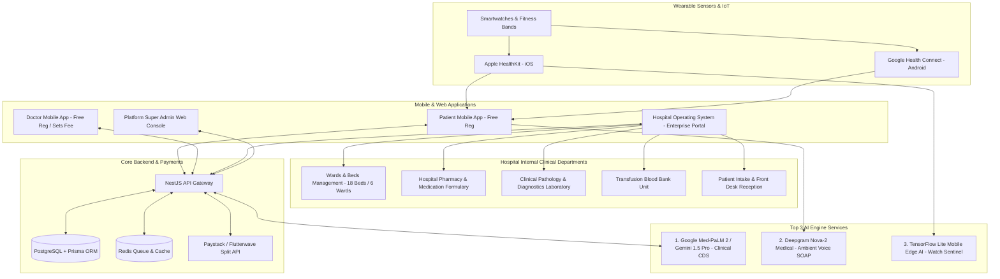
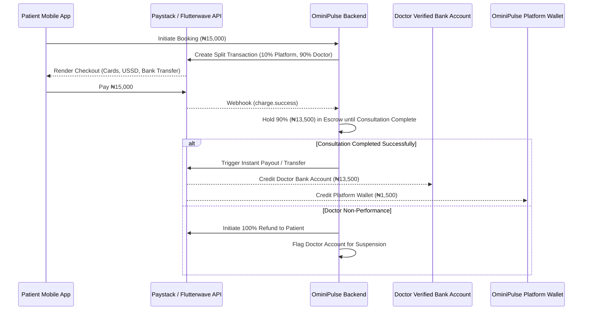
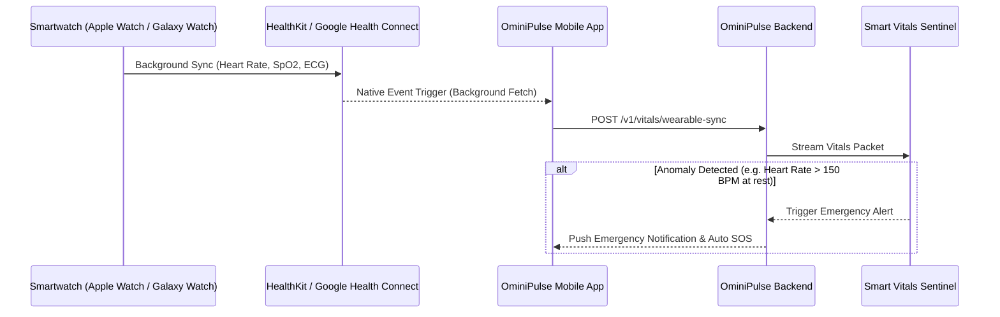

# 🚀 OminiPulse: Next Stages Architecture, Backend Design, Wearable Sync & AI Engine Roadmap

> **Authoritative Technical Handover & Implementation Blueprint**  
> **Target Version**: OminiPulse v2.2 (Enterprise Health & Hospital Operating System Edition)  
> **Architectural Scope**: Mobile (React Native/Expo), Web Admin & Hospital Portal (Next.js/React), Backend API (NestJS/PostgreSQL), Smartwatch Sync (HealthKit/Health Connect), Payment Gateways (Paystack/Flutterwave), True AI Engine (CDS, Voice SOAP, Sentinel Vitals Monitoring), Hospital Management System (Wards, Pharmacy, Diagnostics Lab, Transfusion).

---

## ❄️ MVP Feature Freezes & Evolution Tracker

The following table tracks initial feature freezes and their subsequent implementation status:

| # | Feature | Reason Frozen Initially | Status / Current Architecture | Phase |
|---|---------|---------------|-----------------|-------|
| 1 | **Smartwatch Sync** (BLE / HealthKit / Health Connect) | Low wearable penetration in target market; high SDK maintenance overhead | `WearableSyncScreen` replaced with manual vitals entry CTA pointing to Chronic Care Tracker. Universal wearable architecture ready for Phase 2 native bridge. | Phase 2 |
| 2 | **GPS Blood Donor & ICU Locator** | Requires active network ops and constant hospital DB updates to be useful | `BloodDonors` entry point accessible via deep link & Emergency Mode ("Request Blood Now"). Strictly adheres to ethical non-commercial facilitation (`Donor ➔ Hospital Blood Bank ➔ Patient`). | Completed in v2.0 |
| 3 | **Deepgram Voice-to-SOAP Generator** | High API latency/cost per call; poor recognition of Nigerian accents and medical slang | Admin SOAP tab retains structured S/O/A/P text inputs with freeze notice. Plug-and-play `.env` keys ready for Deepgram Nova-2 Medical activation. | Phase 2 |
| 4 | **Cryptographic XOR-Fold NDPA Exporter** | Over-engineered for launch; standard PDF export is legally sufficient for NDPA data portability | `PatientProfileScreen` "My Data & Privacy" section includes **Download My Data (PDF/ZIP)** action per NDPA Article 26. | Completed in v2.0 |
| 5 | **Admin & Hospital RBAC** | Managing granular tiers added backend logic bloat in early prototyping | **GRADUATED & FULLY EXPANDED**: Upgraded from 2 roles to a robust **8-tier multi-department clinical matrix** (`admin`, `doctor`, `hospital_admin`, `nurse`, `receptionist`, `blood_officer`, `pharmacist`, `lab_technician`) with dedicated workspaces. | Completed in v2.2 |
| 6 | **Pharmacy Radar & Direct Checkout** | Managing external pharmacy inventory APIs and drug-fulfillment logistics delays launch | External consumer delivery replaced with **Internal Hospital Pharmacy & Dispensary** module with stock formulary, batch expiration tracking, and 1-click ward dispensing. | Completed in v2.2 |

---

## 🧭 Executive Summary & Handover Context

OminiPulse is an all-in-one e-Health platform built for the African market (starting with Nigeria), providing digital telehealth consultations, e-prescriptions, GPS pharmacy/hospital directories, blood donor matching, electronic health record (EHR) management, and a complete **Hospital Operating System (HMS)** for inpatient facility management.



---

## 🏛️ Stage-by-Stage Implementation Matrix

```
┌────────────────────────────────────────────────────────────────────────────────────────┐
│                                STAGE IMPLEMENTATION MATRIX                            │
├───────────────┬───────────────────────────────────┬────────────────────────────────────┤
│ Stage         │ Focus Area                        │ Key Deliverables                   │
├───────────────┼───────────────────────────────────┼────────────────────────────────────┤
│ Stage 1       │ Data Wiring & State Management    │ Complete Redux/Zustand & React     │
│               │                                   │ Query integration for real endpoints│
├───────────────┼───────────────────────────────────┼────────────────────────────────────┤
│ Stage 2       │ Production Backend API & Payments │ NestJS API, PostgreSQL DB, Redis,  │
│               │                                   │ Paystack/Flutterwave Split Payments│
├───────────────┼───────────────────────────────────┼────────────────────────────────────┤
│ Stage 2.5     │ Hospital Operating System (HMS)   │ Inpatient Wards/Beds, Internal     │
│               │ Multi-Department Clinical Portal  │ Pharmacy, Diagnostic Lab, Billing  │
├───────────────┼───────────────────────────────────┼────────────────────────────────────┤
│ Stage 3       │ Smartwatch / Wearable Health Sync │ HealthKit & Health Connect bridges,│
│               │                                   │ real-time vitals streaming         │
├───────────────┼───────────────────────────────────┼────────────────────────────────────┤
│ Stage 4       │ Cross-Feature Closed-Loop Audit   │ End-to-end data pipeline across    │
│               │                                   │ Patient, Doctor, Hospital & Admin  │
├───────────────┼───────────────────────────────────┼────────────────────────────────────┤
│ Stage 5       │ Top 3 Medical AI Engine           │ Clinical CDS, Voice SOAP notes,    │
│               │                                   │ Smart Vitals Anomaly Sentinel      │
└───────────────┴───────────────────────────────────┴────────────────────────────────────┘
```

---

## 🏥 Stage 2.5: Hospital Multi-Department Operating System (HMS)

### 1. Inpatient Wards & Bed Availability Matrix
- **Floor Mapping**: 18 licensed beds across 6 hospital wards:
  - **Intensive Care Unit (ICU)** (3 beds) — Critical invasive monitoring
  - **Emergency Resuscitation** (3 beds) — Rapid trauma triage
  - **Male Surgical Ward** (3 beds) — Post-operative recovery
  - **Female Medical Ward** (3 beds) — General internal medicine
  - **Pediatrics & Neonatal** (3 beds) — Specialized infant care
  - **Maternity & Labor** (3 beds) — Obstetric care
- **Bed Lifecycle States**:
  - `available`: Disinfected, sanitized, ready for immediate intake
  - `occupied`: Currently assigned to an admitted patient
  - `cleaning_required`: Patient discharged or transferred; awaiting housekeeping disinfection
  - `maintenance`: Physical or electrical servicing
- **Workflows**: Quick admission modal, inter-ward bed transfer with automated housekeeping status update, 1-click discharge & sanitization verification.

### 2. Hospital Pharmacy Dispensary & Drug Formulary
- **Prescription Queue**: Linked to inpatient charts and doctor consultations with 1-click dispensing status updates (`pending` ➔ `dispensed`).
- **Medication Formulary Inventory**: Real-time stock levels, re-order thresholds, unit prices (₦), batch codes, and expiration dates.
- **Stock Management**: "Add Medication Stock" modal with batch registration, low-stock visual chips, and batch expiration alerts.

### 3. Clinical Diagnostics & Pathology Laboratory
- **Specimen Pipeline**: Tracking sample intake (Whole Blood, Serum, Plasma, Urine, Swabs) from collection to analysis.
- **Result Verification**: "Enter Results" modal allowing Medical Laboratory Scientists to input quantitative values, standard reference ranges, and clinical pathology observations.
- **Digital Pathology Report Generator**: Full verified report modal with electronic signature sign-off (`MLS. Emeka Nnamdi`) and 1-click **"Print Official Lab Slip"** action.

### 4. Enterprise Hospital Billing & Institutional Revenue
- **Annual Enterprise Contract**: Subscription management for institutional hospital licenses (Tier 2 Annual Contract: ₦1,200,000/yr).
- **Revenue Disbursements**: Automatic 85/15 split reconciliation (85% net facility payout / 15% platform infrastructure maintenance).
- **FIRS-Compliant Invoices**: Official tax invoices and 1-click printable PDF receipts.
- **Institutional Billing Desk**: Undisclosed hospital pricing model with a direct enterprise sales desk modal (`partnerships@ominipulse.ai` / `+234 800 OMINI PULSE`).

### 5. Zero-Browser-Alert Modern UI Standard
- 100% of native browser `alert(...)` popups have been removed and replaced with custom in-app modals:
  - Diagnostic Pathology Report Modal
  - Institutional Billing Desk Modal
  - Official Invoices & PDF Receipts Modal
  - Bed Capacity & Sanitation Notice Modal
  - Forensic Evidence Inspection Modal
  - App Store QR Download Modal

---

## 💳 Stage 2: Backend Architecture & Payment Gateway Integration

### 1. Technology Stack Selection
- **Framework**: NestJS (TypeScript) with modular dependency injection.
- **Database**: PostgreSQL 16+ with Prisma ORM for type-safe schema migrations.
- **Cache & Queue**: Redis + BullMQ for handling push notifications, SMS alerts, and background vitals polling.
- **Real-Time Communication**: Socket.io / WebSockets for consultation messaging and WebRTC signaling.
- **Payment Gateway Integration**: Paystack & Flutterwave Split Payments API.

### 2. Commercial Pricing & Commission Architecture
- **Patients**: 100% Free registration. Patients only pay consultation fees when booking appointments.
- **Doctors**: 100% Free registration and MDCN verification. Doctors independently configure their consultation fees (e.g., ₦15,000).
- **Escrow & Split**: Platform fee is held in escrow until consultation concludes. On session completion:
  - 90% disbursed to Doctor Verified Bank Account.
  - 10% disbursed to OminiPulse Platform Revenue Account.
  - If doctor fails to attend, 100% is refunded to patient and doctor account is flagged for review.
- **Hospitals**: Custom enterprise annual contract based on bed capacity and modules (contact institutional sales desk).



### 3. Extended Database Schema ERD (Prisma Definition)

```prisma
datasource db {
  provider = "postgresql"
  url      = env("DATABASE_URL")
}

generator client {
  provider = "prisma-client-js"
}

enum Role {
  PATIENT
  DOCTOR
  HOSPITAL_ADMIN
  NURSE
  RECEPTIONIST
  BLOOD_OFFICER
  PHARMACIST
  LAB_TECHNICIAN
  ADMIN
}

enum BedStatus {
  AVAILABLE
  OCCUPIED
  CLEANING_REQUIRED
  MAINTENANCE
}

enum LabOrderStatus {
  ORDERED
  SAMPLE_COLLECTED
  ANALYZING
  RESULTS_READY
}

model HospitalFacility {
  id              String           @id @default(uuid())
  name            String
  licenseNumber   String           @unique
  city            String
  state           String
  licensedBeds    Int              @default(18)
  annualFeeNgn    Float
  contractStatus  String           @default("active")
  beds            HospitalBed[]
  medications     MedicationItem[]
  labOrders       LabOrder[]
  staff           User[]
}

model HospitalBed {
  id              String           @id @default(uuid())
  hospitalId      String
  hospital        HospitalFacility @relation(fields: [hospitalId], references: [id])
  bedNumber       String
  ward            String
  room            String
  status          BedStatus        @default(AVAILABLE)
  currentPatient  String?
  diagnosis       String?
  assignedNurse   String?
  admissionDate   DateTime?
}

model MedicationItem {
  id              String           @id @default(uuid())
  hospitalId      String
  hospital        HospitalFacility @relation(fields: [hospitalId], references: [id])
  name            String
  category        String
  dosageForm      String
  currentStock    Int
  minStockLevel   Int              @default(20)
  unitPriceNgn    Float
  batchNumber     String
  expirationDate  DateTime
}

model LabOrder {
  id              String           @id @default(uuid())
  hospitalId      String
  hospital        HospitalFacility @relation(fields: [hospitalId], references: [id])
  orderNumber     String           @unique
  patientName     String
  patientId       String
  testName        String
  testCategory    String
  sampleType      String
  status          LabOrderStatus   @default(ORDERED)
  resultsSummary  String?
  normalRange     String?
  findings        String?
  technicianName  String?
  verifiedAt      DateTime?
}
```

---

## ⌚ Stage 3: Smartwatch & Wearable Device Integration Architecture



---

## 🔗 Stage 4: Cross-Feature Closed-Loop Data Flow Audit

| Data Source (Input Feature) | Output Feature 1 (Patient) | Output Feature 2 (Doctor) | Output Feature 3 (Hospital / Admin) |
|---|---|---|---|
| **Doctor Sets Fee (₦15,000)** | Displays on Patient Booking screen | Doctor Profile & Income Breakdown | Financial Commission Ledger (10% platform fee) |
| **Nurse Admits Inpatient** | Patient EHR Inpatient Bed Card | Attending Doctor Rounds Ward List | Ward Floor Occupancy KPI Matrix |
| **Doctor Prescribes Drug** | Patient Prescription Slip & Refills | Consultation SOAP History | Hospital Pharmacy Dispensary Queue |
| **Doctor Orders Lab Test** | Patient Lab Slip & Test Status | Doctor Patient Diagnostics Tab | Hospital Lab Orders & Results Queue |
| **Lab Scientist Verifies Result** | Patient Lab Results & Notification | Live Doctor Chart Notification | Hospital Lab Archive & Audit Trail |
| **Patient Incident Report** | Confirmation & Status Tracker | Notification of Inquiry Notice | Admin Disciplinary Resolution Console |

---

## 🤖 Stage 5: Top 3 Medical AI Engine Technologies

```
┌────────────────────────────────────────────────────────────────────────────────────────┐
│                        TOP 3 AI TECHNOLOGIES FOR OMINIPULSE                           │
├────────────────────────────────────────────────────────────────────────────────────────┤
│                                                                                        │
│  [1. Google Med-PaLM 2 / Gemini 1.5 Pro (Clinical Domain Fine-Tuned)]                 │
│  • Clinical Decision Support (CDS) for Doctors & Nurses                                │
│  • Differential Diagnosis Generation & Drug Interaction Safety Checks                  │
│  • Patient Symptom Checker, 3D Body Symptom Navigator, & EHR Summarization             │
│                                                                                        │
│  [2. Deepgram Nova-2 Medical / OpenAI Whisper Medical Speech Engine]                   │
│  • Ambient Voice-to-Text Clinical Consultation Transcription                           │
│  • Automated Medical SOAP Note Generation (Subjective, Objective, Assessment, Plan)    │
│                                                                                        │
│  [3. TensorFlow Lite / PyTorch Mobile Edge AI Engine]                                  │
│  • On-Device Real-Time Smartwatch Sensor Anomaly Detection                             │
│  • Background Tachycardia, AFib & Hypoxia Alert Sentinel                               │
│  • Automated Emergency SOS GPS Hospital Navigator Trigger                              │
│                                                                                        │
└────────────────────────────────────────────────────────────────────────────────────────┘
```

---

## 🔑 Plug-and-Play AI API Key Configuration

```env
# ─── OMINIPULSE AI ENGINE CONFIGURATION (.env) ─────────────────────────────────
EXPO_PUBLIC_ENABLE_AI_COPILOT=true

# 1. Primary Clinical Intelligence (Google Gemini 1.5 Pro / Med-PaLM 2)
GEMINI_API_KEY=your_google_gemini_api_key_here
GEMINI_CLINICAL_MODEL=gemini-1.5-pro-latest

# 2. Ambient Voice SOAP Note Transcription (Deepgram Nova-2 Medical / Whisper)
DEEPGRAM_API_KEY=your_deepgram_medical_api_key_here
OPENAI_API_KEY=your_openai_api_key_here

# 3. Vision OCR & MDCN Credential Verification (Google Cloud Vision / AWS Textract)
AI_VISION_API_KEY=your_ocr_vision_api_key_here
```

---

## 📝 Developer & Agent Implementation Progress Checklist

### ✅ Completed Milestones (OminiPulse v2.2.0)

- [x] **Hospital Multi-Department Operating System (HMS)**:
  - 18 licensed beds mapped across 6 wards with full admission, transfer, and sanitation tracking.
  - Hospital Pharmacy Dispensary with prescription queue and stock formulary expiration alerts.
  - Clinical Pathology Laboratory with specimen pipeline, verified results entry, and printable diagnostic slips.
  - Enterprise Billing with FIRS-compliant invoices, automated revenue split disbursements, and sales desk modals.
- [x] **8-Tier Role-Based Access Control (RBAC)**: Dedicated sidebars, credentials, and auto-routing for `admin`, `doctor`, `hospital_admin`, `nurse`, `receptionist`, `blood_officer`, `pharmacist`, and `lab_technician`.
- [x] **Zero-Browser-Alert UI Architecture**: 100% of native browser alerts replaced with custom in-app modals.
- [x] **Commercial Model Transparency**: Free Patient & Doctor onboarding, custom doctor consultation fee setting, escrow payout hold, and undisclosed institutional pricing.
- [x] **3D Anatomical Body Navigator & Social Proof**: Interactive 3D model and verified patient testimonials on landing page.
- [x] **NDPA 2023 Regulatory Compliance**: Full platform replacement of HIPAA with NDPA 2023 Article 26 export and audit logging.
- [x] **Doctor MDCN Expiry & Verification System**: 5-credential audit modal with 30-day renewal grace period.
- [x] **Blood Donor Network & Emergency Mode ("Request Blood Now")**: Non-commercial ethical matching (`Donor ➔ Hospital Blood Bank ➔ Patient`).
- [x] **AI Assistant & Health Insights Suite**: Gemini 1.5 Pro symptom guidance, vitals analysis, OCR document summarization, and chronic care tracking.

---

### 🚀 Upcoming Backend & Production Integration Checklist

- [ ] **Step 1**: Connect mobile and web state management (Zustand/React Query) to NestJS production API endpoints.
- [ ] **Step 2**: Deploy NestJS API backend with PostgreSQL database migrations including HospitalFacility, HospitalBed, MedicationItem, and LabOrder models.
- [ ] **Step 3**: Configure Paystack & Flutterwave Automated Split Payment webhooks for Doctor payouts (90/10) and Hospital revenue disbursements (85/15).
- [ ] **Step 4**: Install `react-native-health` (iOS) and `react-native-health-connect` (Android) native modules for background smartwatch syncing.
- [ ] **Step 5**: Plug in `GEMINI_API_KEY` / `OPENAI_API_KEY` in production `.env` to activate live Gemini clinical copilot & Admin MDCN OCR engine.
- [ ] **Step 6**: Integrate Deepgram Nova-2 Medical for real-time ambient voice consultation SOAP note generation.

---

*This document is saved in the repository root (`/NEXT_STAGES_ROADMAP_AND_ARCHITECTURE.md`) and the artifacts directory for session continuity.*
